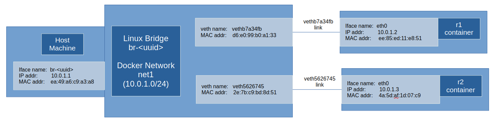

# Demo 1: Running OSPF daemon and other foundational daemons in a docker container

The key to this demo is the script `docker-start-1-StartDaemons` [here](./dockerfiles/docker-start-1-StartDaemons) which runs the frr daemons in the background.  Note there is a (rather unsafe) way to run the daemons using systemd by using the `cap_add=net_raw` etc. options when running a container, but this approach is not used (it is used in [this](https://github.com/ksator/frrouting_demo) github repo by ksator, for instance).

As a bonus, there is also an 'Exposition of Linux bridges' at the end of this demo.

## Network topology of demo 1

A new network `net1` will be created with 2 docker containers (`r1` and `r2`) attached to this network each running the frr OSPF daemon.  The daemons will each target the eth0 interface and the `10.0.1.0/24` network.

~~~
┌─────────────┐     ┌─────────────┐              ┌────────────────────┐
│     Host    │     │             │              │──────────┐         │
│             │     │             │    veth1     │   eth0   │   r1    │
│┌────────────│     │             ┼──────────────┼(10.0.1.2)│         │
││  [Gateway] │     │    net1     │              │──────────┘         │
││   br-if1  ─│─────┼(10.0.1.0/24)│              └────────────────────┘
││ (10.0.1.1) │     │             │              ┌────────────────────┐
│└────────────│     │             │              │──────────┐         │
└─────────────┘     │             │    veth2     │   eth0   │   r2    │
                    │             ┼──────────────┼(10.0.1.3)│         │
                    └─────────────┘              │──────────┘         │
                                                 └────────────────────┘
~~~

The expectation is that the OSPF daemons to see neighbouring OSPF routers, and these will be evident in the OSPF neighbor, link state database and routing tables.

The Linux bridge perspective includes a bit more detail, including the MAC addresses on both ends of the `veth` interfaces that branch from the bridge.

## Docker build image command
To build the docker images, run the following docker command from the root directory of the repository (`frr_venore/`). Both routers r1 and r2 will be based off the same image.
~~~
$ docker build -t frr-ubuntu22:latest -f josh_sandbox/demo1_run-daemons-in-containers/dockerfiles/Dockerfile_1_StartDaemons .
~~~

## Create a new network (`net1`) using docker

To make the demo more reproducible, it's good practice to create another network, in this case a `10.0.1.0/24` one.  In effect, this creates a Linux bridge network with the assigned network specification.  It is instructive to think of a bridge as a software switch (layer 2 device), with an associated MAC address table (MAC-to-port) or Forwarding Database (fdb) table.

Create the network (called `net1`) with this docker command:
~~~
$ docker network create --driver=bridge --subnet=10.0.1.0/24 net1
~~~

Containers created on this network (with the `--network net1` flag during `docker run`) will be assigned ascending IP addressed from `10.0.1.2` and upwards on the `eth0` interface. For this demo, the OSPF daemons on r1 and r2 will be assigned to work these `eth0` interfaces.  The `10.0.1.1` address will actually be the gateway (which you can verify with `docker network inspect net1`).  You can even see this network with `ifconfig` on the host:

~~~
$ ifconfig
br-c4c5fe0bfed2: flags=4099<UP,BROADCAST,MULTICAST>  mtu 1500
        inet 10.0.1.1  netmask 255.255.255.0  broadcast 10.0.1.255
        ether ae:4c:8f:27:c8:c5  txqueuelen 0  (Ethernet)
        RX packets 0  bytes 0 (0.0 B)
        RX errors 0  dropped 0  overruns 0  frame 0
        TX packets 0  bytes 0 (0.0 B)
        TX errors 0  dropped 13 overruns 0  carrier 0  collisions 0
~~~

Note that the `br-*` name designation signifies this is a Linux bridge.

## Run a container for router 1 (r1)
Things to note:
- This container for r1 MUST be run before r2, so it gets the `10.0.1.2` IP address.
- Note the `--network net1` flag to ensure this joins the `10.0.1.0/24` network created above.
- Note the volume binding argument (`-v`) I used to put the necessary `frr.conf` file into the location expected by the frr daemons.

Run the following command from the repository root:
~~~
$ docker run -d --init --privileged --name frr-ubuntu22-demo1-r1 --network net1 --mount type=bind,source=/lib/modules,target=/lib/modules -v ./josh_sandbox/demo1_run-daemons-in-containers/frrconf_files/r1:/etc/frr frr-ubuntu22:latest
~~~

## Run a container for router 2 (r2)
Run a container for router 2 (r2).  Run the following command from the repository root:
~~~
$ docker run -d --init --privileged --name frr-ubuntu22-demo1-r2 --network net1 --mount type=bind,source=/lib/modules,target=/lib/modules -v ./josh_sandbox/demo1_run-daemons-in-containers/frrconf_files/r2:/etc/frr frr-ubuntu22:latest
~~~

## Checking OSPF is working

1. Show various OSPF-related tables. In r1:
~~~
$ docker exec -it frr-ubuntu22-demo1-r1 bash
~~~
Use `vtysh` to see the `Neighbor Table`:
~~~
~/frr$ sudo vtysh

eea8ed44d4b7# show ip ospf neighbor

Neighbor ID     Pri State           Up Time         Dead Time Address         Interface                        RXmtL RqstL DBsmL
2.2.2.2           1 Full/DR         49.703s           30.307s 10.0.1.3        eth0:10.0.1.2                        0     0     0
~~~
The `Link State Table` 
~~~
eea8ed44d4b7# show ip ospf database

       OSPF Router with ID (1.1.1.1)

                Router Link States (Area 0.0.0.0)

Link ID         ADV Router      Age  Seq#       CkSum  Link count
1.1.1.1        1.1.1.1          415 0x80000004 0x2301 1
2.2.2.2        2.2.2.2          416 0x80000003 0xe635 1

                Net Link States (Area 0.0.0.0)

Link ID         ADV Router      Age  Seq#       CkSum
10.0.1.3       2.2.2.2          416 0x80000001 0x2018
~~~
And the `Routing Table` (RIB):
~~~
eea8ed44d4b7# show ip ospf route 
============ OSPF network routing table ============
N    10.0.1.0/24           [10] area: 0.0.0.0
                           directly attached to eth0

============ OSPF router routing table =============

============ OSPF external routing table ===========
~~~

## Cleaning up after the demo

Stopping and remove all the containers above:

~~~
$ docker rm -f frr-ubuntu22-demo1-r1 frr-ubuntu22-demo1-r2
~~~

 We should also remove the docker network `net1` we created with this command:

~~~
$ docker network rm net1
~~~

This removes the `br-<uuid>` from the listing under `ifconfig`.

## Bonus: An exposition of Linux bridges

As mentioned above, the `docker network create` command creates a Linux bridge for `net1`, which operates a bit like a layer-2 switch.  This bonus section ties up several key concepts, including:

- Linux bridges (and how to see them with `ifconfig`)
- Understanding the forwarding database (fdb) table on the bridge
- New fdb entries introduced as containers are connected to the bridge
- The role of `veth` in connecting the containers to the bridge
- Show the ARP cache using the `ip neigh` command

Hopefully this is educational even for an understanding of how layer 2 switching works.  Remember, hosts store `ARP cache` (IP-to-MAC table) while switches/bridges store `MAC addr table' (MAC-to-Port table).

This is a diagram showing the relationship between all the components.

After the `net1` network is created by Docker, you can view the 'fdb table' on the bridge (in this case, `br-31abaedd7ba9`) using `bridge fdb show`:
~~~
$ bridge fdb show | grep br-
33:33:00:00:00:01 dev br-31abaedd7ba9 self permanent
01:00:5e:00:00:6a dev br-31abaedd7ba9 self permanent
33:33:00:00:00:6a dev br-31abaedd7ba9 self permanent
01:00:5e:00:00:01 dev br-31abaedd7ba9 self permanent
01:00:5e:00:00:fb dev br-31abaedd7ba9 self permanent
ea:49:a6:c9:a3:a8 dev br-31abaedd7ba9 vlan 1 master br-31abaedd7ba9 permanent
ea:49:a6:c9:a3:a8 dev br-31abaedd7ba9 master br-31abaedd7ba9 permanent
~~~

This shows are mapping of MAC address to device/port, similar to a physical switch. The first 5 entries are IPv4 and IPv6 multicast addresses, and are introduced by default.  The final 2 entries relate to the MAC address of the virtual interface created on the host to connect to this bridge.  MAC addresses are labelled as `ether` under `ifconfig` (i.e. `ether ea:49:a6:c9:a3:a8`):

~~~
$ ifconfig
br-31abaedd7ba9: flags=4163<UP,BROADCAST,RUNNING,MULTICAST>  mtu 1500
        inet 10.0.1.1  netmask 255.255.255.0  broadcast 10.0.1.255
        inet6 fe80::e849:a6ff:fec9:a3a8  prefixlen 64  scopeid 0x20<link>
        ether ea:49:a6:c9:a3:a8  txqueuelen 0  (Ethernet)
        RX packets 16  bytes 820 (820.0 B)
        RX errors 0  dropped 0  overruns 0  frame 0
        TX packets 38  bytes 5553 (5.5 KB)
        TX errors 0  dropped 19 overruns 0  carrier 0  collisions 0
~~~

When a container like `r1` is connected to this docker network/bridge, new fdb entries are added. The important ones to note are those relating to the `veth` interface created to connect the container to the bridge:

~~~
$ bridge fdb show | grep br-
<TRUNCATED>
ee:85:ed:11:e8:51 dev vethb7a34fb master br-31abaedd7ba9
d6:e0:99:b0:a1:33 dev vethb7a34fb vlan 1 master br-31abaedd7ba9 permanent
d6:e0:99:b0:a1:33 dev vethb7a34fb master br-31abaedd7ba9 permanent
<TRUNCATED>
~~~

Where there are 2 unique MAC address here:

  - `d6:e0:99:b0:a1:33` is the end of the `veth` interface connected to the bridge
  - `ee:85:ed:11:e8:51` is the end of the `veth` interface connected to the container

This can be verified by running `ifconfig` on the host (yielding `d6:e0:99:b0:a1:33`):
~~~
$ ifconfig
vethb7a34fb: flags=4163<UP,BROADCAST,RUNNING,MULTICAST>  mtu 1500
        inet6 fe80::d4e0:99ff:feb0:a133  prefixlen 64  scopeid 0x20<link>
        ether d6:e0:99:b0:a1:33  txqueuelen 0  (Ethernet)
        RX packets 16  bytes 1044 (1.0 KB)
        RX errors 0  dropped 0  overruns 0  frame 0
        TX packets 63  bytes 8624 (8.6 KB)
        TX errors 0  dropped 0 overruns 0  carrier 0  collisions 0
~~~

and also inside container `r1` (yielding `ee:85:ed:11:e8:51`):

~~~
frr@d8c349a2a69d:~/frr$ ifconfig

eth0: flags=4163<UP,BROADCAST,RUNNING,MULTICAST>  mtu 1500
        inet 10.0.1.2  netmask 255.255.255.0  broadcast 10.0.1.255
        ether ee:85:ed:11:e8:51  txqueuelen 0  (Ethernet)
        RX packets 132  bytes 21887 (21.8 KB)
        RX errors 0  dropped 0  overruns 0  frame 0
        TX packets 180  bytes 13836 (13.8 KB)
        TX errors 0  dropped 0 overruns 0  carrier 0  collisions 0
~~~

Also inside `r1`, if you do `ip neigh` you get nothing returned, because there is no OSPF discovered neighbour yet (`r2` isn't run yet!).  So let's run container `r2`, and do run `ip neigh` in the `r1` container again:

~~~
frr@d8c349a2a69d:~/frr$ ip neigh
10.0.1.3 dev eth0 lladdr 4a:5d:af:1d:07:c9 REACHABLE proto zebra
~~~

We can see the ARP cache (IP-to-MAC address mapping) entry for `r2` (IP addr `10.0.1.3`), and indeed the MAC address there (`4a:5d:af:1d:07:c9`) is the MAC address you find if you run `ifconfig` in the `r2` container:

~~~
frr@9252efdc44a0:~/frr$ ifconfig
eth0: flags=4163<UP,BROADCAST,RUNNING,MULTICAST>  mtu 1500
        inet 10.0.1.3  netmask 255.255.255.0  broadcast 10.0.1.255
        ether 4a:5d:af:1d:07:c9  txqueuelen 0  (Ethernet)
        RX packets 108  bytes 12511 (12.5 KB)
        RX errors 0  dropped 0  overruns 0  frame 0
        TX packets 59  bytes 4558 (4.5 KB)
        TX errors 0  dropped 0 overruns 0  carrier 0  collisions 0
~~~

There are some questions remaining, such as whether the full ARP workflow is used to populate the ARP cache and MAC address tables in the containers and bridge respectively.  