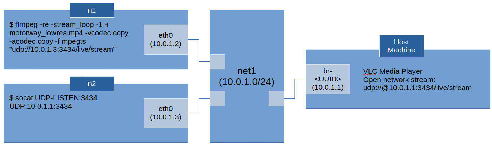
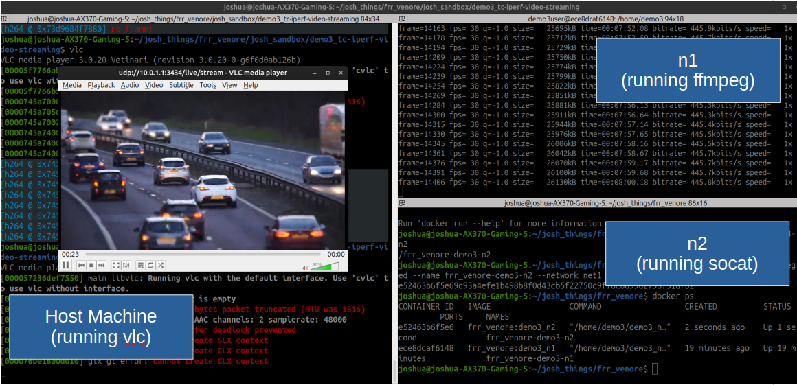

# Demo 3: Traffic Control, iPerf and Video Streaming

## Network Schematic of Demo 3

The network schematic is shown below.

This demo doesn't use frr, but explores tools like :

- `tc` (traffic control) which provides a means to define queue disciplines and throttle the speed of interfaces.  
- `iperf3` which provides a way to measure the maximum link throughput
- `ffmpeg` for video streaming
- `socat` for redirecting socket data flows

n2 redirects the stream to the host because it's easier to view a stream on the host machine and saves the effort of setting up display and X display in n2.

## Create network (`net1`) using docker command

If `net1` does not already exist (it was create in demo1), then create it with command:

~~~
$ docker network create --driver=bridge --subnet=10.0.1.0/24 net1
~~~

And check that it exists with:
~~~
$ ifconfig

br-abaa46ceff04: flags=4099<UP,BROADCAST,MULTICAST>  mtu 1500
        inet 10.0.1.1  netmask 255.255.255.0  broadcast 10.0.1.255
        ether 32:a4:44:59:76:ce  txqueuelen 0  (Ethernet)
<...TRUNCATED...>
~~~

## Build docker images for nodes `n1` and `n2`

Build the docker images by running the following docker commands from the root directory of the repository (`frr_venore/`). The main difference between the dockerfiles for `n1` and `n2` is the command (CMD) run when the container starts.  For `n1`:
~~~
$ docker build -t frr_venore:demo3_n1 -f josh_sandbox/demo3_tc-iperf-video-streaming/dockerfiles/Dockerfile_demo3_n1 .
~~~

For `n2`:
~~~
$ docker build -t frr_venore:demo3_n2 -f josh_sandbox/demo3_tc-iperf-video-streaming/dockerfiles/Dockerfile_demo3_n2 .
~~~

## Run container for node `n1`: video stream source

This container will be the source of the the ffmpeg stream.
~~~
$ docker run -d --init --privileged --name frr_venore-demo3-n1 --network net1 frr_venore:demo3_n1
~~~

## Run container for node `n2`: video stream destination

This container redirects the incoming video stream from `n1` to the host machine (10.0.1.1) using 'socat' (SOcket CAT).
~~~
$ docker run -d --init --privileged --name frr_venore-demo3-n2 --network net1 frr_venore:demo3_n2
~~~

Socat is initiated in a while bash loop continually, see the [bash script](dockerfiles/demo3_n2.sh).  If it isn't enclosed in a while loop with 'continue' the docker container will stop if socat throws an error, which we don't want.  Socat will throw an error if the destination socket is not listening.

## Start stream in `n1` container

Docker exec into the container:

~~~
$ docker exec -it frr_venore-demo3-n1 bash
~~~

And begin the stream:

~~~
$ ffmpeg -re -stream_loop -1 -i motorway_lowres.mp4 -vcodec copy -acodec copy -f mpegts "udp://10.0.1.3:3434/live/stream"
~~~

Note how we are directing the stream to `n2`'s IP address. I suppose this address could be a multicast address too. The stream format is 'mpegts' (MPEG Transport Stream).

## Start listening for the stream on the host machine

Open VLC and enter the network URL:
~~~
$ vlc
~~~
~~~
udp://@10.0.1.1:3434/live/stream
~~~

## Measuring link throughput with iPerf3

Run iperf3 server on `n2`:
~~~
$ iperf3 -s
~~~

Run iperf3 client on `n1`:
~~~
$ iperf3 -c 10.0.1.3
~~~

I find that the token bucket qdisc works quite well to throttle the iperf performance, while bfifo has no effect unitl <1000 bytes per second.

# !!!DRAFT NOTES BELOW!!!

## Throttle bitrate throughput of eth0 interface on `n1`

Token Bucket Filter exmaple:
~~~
$ sudo tc qdisc add dev eth0 root tbf rate 1mbit burst 32kbit latency 5ms
~~~

Restore normal queue discpline:
~~~
$ sudo tc qdisc replace dev eth0 root pfifo
~~~

~~~
TESTER for bytes fifo
$ sudo tc qdisc add dev eth0 root bfifo limit 5000
$ sudo tc qdisc change dev eth0 root bfifo limit 1000
~~~

NetEm example:
~~~
sudo tc qdisc change dev eth0 root netem delay 10ms 5ms 1%
~~~

## Using tc NetEm and tbf

https://www.cs.unm.edu/~crandall/netsfall13/TCtutorial.pdf

